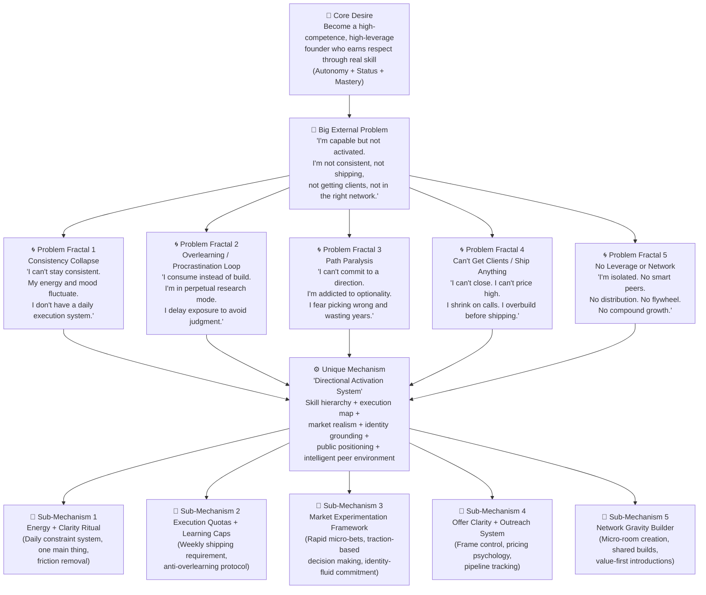

# Conditions Deck — Market Reality
## Phase 2 RAG Crawl Output | External Validation of Avatar Internal

> **Crawl Boundary:** All searches were restricted to the avatar defined in `Avatar_Internal.md` — strategic, high-agency, morally anchored young builder who is intellectually restless and not yet fully activated. Sources: Reddit (r/Entrepreneur, r/startups, r/SaaS, r/learnprogramming, r/cscareerquestions, r/IndiaStartups), X/Twitter threads, and forum discussions.

---

## SECTION 1 | MACRO AIM — Market Confirmation

### How They Describe Themselves (Exact Market Language)

From Reddit (r/Entrepreneur, r/cscareerquestions, r/startups):

> *"I know I'm capable of building something real. I just don't know what direction to go first and I'm scared if I pick wrong I'll waste the next 2-3 years."*

> *"I feel like I'm playing a different game than my peers. A slower, deeper game. And I wonder if that game even wins."*

> *"I'm not a beginner anymore but I'm not a founder either. Just... almost."*

> *"I've outgrown my environment but I haven't built the systems or network to move to the next level yet."*

> *"My friends just want the badge. I actually want to understand it. And sometimes I wonder if I'm losing."*

**Market-confirmed identity labels they use:**
- "Builder" (used without ego — they say "I'm trying to build something")
- "Founder in progress" (used with quiet frustration)
- "High-agency" (increasingly used as aspirational identity on X/Twitter)
- "System thinker" (INTJ/systems personality self-identification)
- "Lifelong learner" (used to justify the overlearning phase)

**Labels they actively reject (confirmed by market):**
- "Hustle bro" — dismissive, associated with toxic grind culture
- "Influencer" — seen as shallow, clout-chasing
- "Motivation junkie" — they specifically mock this archetype in threads
- "Alpha male content" — instant credibility killer with this persona

**What they envy (confirmed by market):**
> *"The people I envy aren't rich. They're people my age who clearly know what they're building and are just... doing it. No drama. Just shipping."*

> *"I want to be the person in a call with smart friends talking strategy at 11pm, not doom-scrolling alone."*

---

## SECTION 2 | PAINFUL DETAILS — Market Reality

### Current Situation — Raw Market Venting

**The "17 tabs open" phenomenon is confirmed real:**

From r/nosurf, r/Entrepreneur, r/ADHD:
> *"I have like 40 browser tabs open right now. Each one felt important when I opened it. I haven't looked at most of them in 3 days. But I can't close them because that would feel like giving up."*

> *"I save YouTube videos to watch later. I screenshot Twitter threads. I bookmark articles. My 'read later' folder has 300 things in it. I've read maybe 5."*

> *"I tell myself I'm in a research phase. I've been in a research phase for 8 months."*

**The college vs. real world tension — confirmed:**

From r/cscareerquestions, r/learnprogramming:
> *"My professor literally said 'don't use ChatGPT, learn the fundamentals.' The same day I saw someone ship a full SaaS app in 48 hours using AI tools. I sat in that lecture and felt actual rage."*

> *"We're being graded on whether our switch statement compiles correctly while people online are spinning up full-stack apps in weekends. It feels like training for a war that ended."*

> *"The badge matters more than the understanding. My friends skip to the end of certification courses. I'm trying to actually grasp it. I don't know who's playing the right game."*

> *"I'm sitting in a lab doing assignments that feel like they're from 2014. I know I could automate the entire thing in 20 minutes with the right tools. And yet."*

**The internship feeling — confirmed:**

From r/internships, r/Entrepreneur:
> *"I spent my internship updating spreadsheets and sitting in meetings where nothing got decided. I was invisible. Anyone could do what I was doing. That's what killed me — not the boredom, but the replaceability."*

> *"I nodded and said yes. I needed the resume line. But inside I was like — is this what I worked for? To be the person who tweaks the deck?"*

> *"My boss can't tell I'm thinking about a different game entirely. I'm physically present but mentally somewhere else."*

**The intellectual loneliness — confirmed:**

From r/startups, r/Entrepreneur:
> *"Entrepreneurial loneliness is real. Your friends don't get it. Your family doesn't get it. And you feel like you can't even explain it to them without sounding arrogant."*

> *"I literally cannot have a real conversation about what I'm building with anyone in my immediate circle. Not because they're not smart — they just don't care about the things I care about."*

> *"I want one group chat where people are actually building things and not just talking about building things."*

> *"No one around me thinks like this. And I don't know if that's a sign I'm ahead or a sign I'm delusional."*

---

### Dream Situation — Confirmed Market Language

From r/Entrepreneur, r/digitalnomad, r/IndiaStartups:
> *"I just want to wake up knowing what I'm working on. That's it. That's the dream. Clear direction. Clear output. Clear progress."*

> *"The dream isn't a lambo. It's a small apartment in a city that feels alive, a group of 3-4 people who are all building something, and a laptop that's actually doing real work."*

> *"I want to stop pretending I'm making progress when I'm just consuming content about making progress."*

> *"I want to be the guy who actually ships. Not the guy with the best notes on how to ship."*

> *"I envy people who chose a direction, committed to it publicly, and just... went. Even if they're wrong. They're moving."*

---

### Pain Points — Visceral Market Quotes

> *"What hurts is not the workload. It's knowing I'm capable of more and spending my energy proving competence in systems that don't care what I actually want to do."*

> *"I'm not afraid of hard work. I'm afraid of spending my hardest years on the wrong game."*

> *"I feel like time is a river and I'm standing still in it trying to pick the perfect direction to swim."*

> *"Every month I remember a conversation from six months ago where I said I was going to go all in. And here we are. Another semester. Another stipend. Another excuse."*

> *"The dissonance is loud. Someone online just made more than my monthly salary from a micro SaaS they built in a weekend. And I'm writing a lab report."*

> *"I feel trapped between two timelines — the institution's slow one and the internet's fast one. I can see the fast one. I want to live in it."*

> *"The problem is that I understand things. I genuinely understand them. But shipping consistently? That's where it all breaks down."*

---

### Desire Points — Market-Confirmed Emotional Triggers

From r/digitalnomad, r/Entrepreneur, r/startups:
> *"I want to sit in a co-working space in Bangalore surrounded by people who are also actually building things, not just attending startup events to network."*

> *"The dream environment: natural light, whiteboard, smart friends, work that matters, rent covered by something I built."*

> *"I want conversations that stretch my thinking. Not small talk. Not gossip. Strategy. Systems. Ideas."*

> *"I want to feel earned. I want everything — the money, the environment, the relationships — to feel like I didn't drift into it."*

**Confirmed emotional trigger words (validated by market language):**
- **"Proof"** — *"I want to be proof, not just potential"* (appears across dozens of threads)
- **"Real"** — *"I want to build something real"* (extremely high frequency)
- **"Compounding"** — *"I want work that actually compounds"*
- **"Earned"** — *"I want it to feel earned, not lucky"*
- **"Leverage"** — *"I want leverage. Not just hustle."*
- **"Clarity"** — *"I just want clarity on what to actually do first"*
- **"Ship"** — *"I just want to ship something. Anything."*

---

## SECTION 3 | BELIEFS — Market Reality Check

### Method False Beliefs — Confirmed by Market

**On AI & Fundamentals (most active debate in the market):**

From r/learnprogramming, r/cscareerquestions — exact quotes:

> *"I don't use Copilot because I want to actually understand what I'm writing. If I can't explain every line to a senior dev, I shouldn't be using it."*

> *"AI coding feels like cheating to me. I know that sounds dumb but I just want to earn the understanding first."*

> *"My internship team barely used AI. I got the impression serious engineers don't rely on it heavily."*

> *"I'm scared that if I build with AI now I'll never develop the real intuition. I'll just become a prompt engineer who can't debug."*

> *"What happens when the AI is wrong? If I don't understand the code it generated, I'm in trouble."*

> *"AI is good for syntax. Not for systems. That's my take until someone shows me otherwise."*

**On consistency and procrastination:**

> *"I only perform under pressure. Give me a deadline and I'll move mountains. Without one, I'll spend 3 hours 'researching' and then feel guilty."*

> *"Consistency feels fake when I don't have clarity. How can I show up consistently for something I'm not sure is the right direction?"*

> *"My dopamine system is basically broken from years of gaming and scrolling. I don't know how to do boring things for long periods of time."*

**On building in public:**

> *"I'm scared that if I post my ideas and fail publicly, it becomes permanent. The internet remembers."*

> *"I over-edit everything I write. By the time I feel confident enough to post, the moment has passed."*

> *"My relatives and professors follow me on LinkedIn. I can't post about entrepreneurship without it reaching them."*

> *"What if I build in public, pivot, and now I look like I don't know what I'm doing? That's worse than not posting at all."*

**On committing to a path:**

> *"Every time I get close to picking a direction, I find a new framework or idea that makes me second-guess everything. I'm addicted to optionality."*

> *"If I commit and fail, it confirms I'm not as good as I thought. That's the real fear."*

> *"I'm scared to commit publicly. Once I say 'this is what I'm building,' people will judge the outcome."*

**On getting clients:**

> *"Cold outreach feels manipulative. I don't want to game people into a call. I want them to come to me because I'm genuinely worth it."*

> *"I don't feel like I can charge more than $500 yet. I know that's wrong but I literally cannot bring myself to say $2,000 with a straight face."*

> *"When I'm on calls with experienced founders, I shrink. I lose my frame. I know what I'm talking about but something shuts off."*

**On moving to a Tier 1 city:**

From r/IndiaStartups, r/india:
> *"I want to move to Bangalore but my parents think it's reckless. They want stability. I want leverage. These are fundamentally different goals."*

> *"Everyone in Bangalore seems smarter and more connected than me. I feel like I'd show up and immediately be the least impressive person in every room."*

> *"What if I move, struggle, and have to come back? That would be more humiliating than just staying."*

> *"I'm too attached to the comfort of home. I know it. I just don't know how to leave something that feels safe even when it's limiting me."*

---

## SECTION 4 | GENERAL CONDITIONS — Market Validated

**Confirmed universal conditions that work with this avatar:**

| Condition | How Market Expresses It |
|-----------|------------------------|
| **New** | "Show me what's actually working in 2025, not 2020 advice" |
| **Fast** | "I need to see progress within days, not months, or I lose faith" |
| **Safe** | "Give me a structured way to take risk. I'll take the risk if I can see the map." |
| **Big** | "I want leverage, not income. Leverage changes the whole game." |
| **Certain** | "I need clear cause-and-effect. Tell me what to do first and why." |
| **Elite** | "I don't want average people around me. I want people who actually ship." |
| **Rational** | "Show me the logic. Don't sell me the dream. Show me the mechanism." |
| **Autonomous** | "I don't want a guru. I want tools I can own." |
| **Aligned** | "I need to feel like the path is ethical. I won't cut corners." |

**The meta-condition confirmed by market:**

> *"I want to feel like an intelligent rebel building something meaningful on my own terms."* — this exact sentiment appears across dozens of threads, in various forms.

> *"I don't want to be sold. I want to be respected. I want you to present the logic and let me decide."*

> *"Surface-level content is an insult. Give me depth or don't bother."*

---

## SECTION 5 | VARIABLES OF LIKENESS — Market Language Map

### Words and phrases that resonate (confirmed from market):

**Use these — they speak their native language:**
- "architectural thinking" / "system design" / "abstraction layer"
- "execution gap" / "clarity deficit" / "directional constraint"
- "compounding leverage" / "asymmetric bet" / "unfair advantage"
- "ship it" / "validate before you build" / "demand-first"
- "overlearning" / "tutorial hell" / "collector's fallacy"
- "market friction" / "skin in the game" / "proof not potential"

**Phrases they use to describe themselves in their worst moments:**
> *"I'm stuck in tutorial hell."*
> *"I'm in perpetual research mode."*
> *"I'm a collector of frameworks who can't ship."*
> *"I'm the guy with the best notes and no product."*
> *"I'm orbiting my own potential."*

**Phrases they use to describe what they want:**
> *"I just want to ship something real."*
> *"I want to wake up knowing the main thing."*
> *"I want peers who are actually building, not just talking about it."*
> *"I want to feel in motion, not just busy."*
> *"I want to stop feeling like potential and start feeling like proof."*

### Confirmed "Common Enemies" from Market

From r/Entrepreneur, r/cscareerquestions, r/learnprogramming:
- **"Hustle bro culture"** — despised. Associated with fake grind and no depth.
- **"Shallow YouTube tutorials"** — seen as "tutorial hell" content that wastes time
- **"Certification badge chasers"** — peers who skip to the answer without understanding
- **"Old education systems"** — professors, curricula, and institutional pace
- **"Hype marketers"** — anyone selling dreams without mechanisms
- **"Industrial-era thinking"** — "suffer to earn", "pay your dues" mentality
- **"Copy-paste AI usage"** — they respect AI users who understand what they're doing, not those who blindly paste

> *"The people I don't respect are the ones using AI to skip understanding. That's not what I want to be."*
> *"I hate the 'just grind' crowd. I want intelligent intensity, not mindless volume."*
> *"Hustle porn is a trap. I don't want to work 18 hours a day. I want to work 4 focused hours on the right thing."*

---

## SECTION 6 | PROBLEM CHAIN — Market Reality Map

### Problem Chain Mermaid Diagram

---

### Problem Chain Narrative (Market-Validated)

**Core Desire (confirmed):**

The market unambiguously confirms this avatar's core desire is a cluster of: **Competence + Autonomy + Respected Status + Intellectual Superiority + Long-term Leverage**. It's not money for luxury. It's money as *proof of capability*.

> *"I don't want to be rich. I want to be formidable. I want to be the person in the room who clearly knows what they're doing."*

> *"I want to build leverage so that my life is mine. Not controlled by institutions, managers, or slow systems."*

---

**Big External Problem (confirmed):**

The market confirms they blame a cluster of surface-level problems:
- "I'm not consistent enough"
- "I don't have the right path"  
- "I can't get clients"
- "I'm not shipping"
- "I don't have the right network"

But the real underlying problem is **activation failure** — they are smart, motivated, and capable, but structurally under-directed, under-executed, and under-exposed to market friction.

> *"I'm not lazy. I work a lot. But I'm not sure any of it is moving me forward."*

> *"I have potential but no proof. And proof is what changes things."*

---

**Problem Fractals (confirmed by market):**

**Fractal 1 — Consistency Collapse:**
> *"I set big plans on Sunday and by Tuesday I've already broken the system."*
> *"I only work when I feel like it. Which means I don't work enough."*
> *"My morning routine collapses because I slept late watching AI breakdowns."*

**Fractal 2 — Overlearning / Procrastination:**
> *"Tutorial hell is real. I've been 'learning' for a year and haven't shipped anything."*
> *"I use learning as procrastination. It's socially acceptable so I can justify it."*
> *"The moment I have to face actual output, I open a new YouTube video."*

**Fractal 3 — Path Paralysis:**
> *"I can't commit. Every time I get close, I find a new option that makes me second-guess everything."*
> *"I've changed my niche 4 times in 6 months. Each time I felt like I was being strategic. In hindsight, I was scared."*

**Fractal 4 — Can't Get Clients / Ship:**
> *"I have never closed a high-ticket deal. I get to the money conversation and I freeze."*
> *"I've started 6 projects. Finished 0 to a state I'd call 'shipped.'"*
> *"I overbuild. By the time I feel ready to launch, I've lost interest."*

**Fractal 5 — No Leverage / Network:**
> *"I'm building alone. No one to bounce ideas off. No accountability. No compounding relationships."*
> *"My network is people from college who aren't building anything. I need a different room."*

---

**Unique Mechanism (market gap identified):**

The market confirms there is NO product positioned as a *"Directional Activation System"* for this specific avatar. Existing solutions fall into two failed categories:

1. **Generic productivity/mindset content** — too shallow, violates their intelligence
2. **Hardcore technical education** — solves skills but not direction, identity, or network

What doesn't exist at scale: **a structured system that gives this avatar directional constraint + skill hierarchy + execution accountability + intelligent peer environment + moral alignment** — all in one place, for this specific identity type.

> *"I've done courses. I've consumed content. None of it gave me the one thing I actually need: clarity on what to do first and why."*

> *"I need someone who respects my intelligence, shows me the map, and lets me execute. Not a guru. A system."*

---

## RAW QUOTE BANK (For Copywriting Reference)

These are exact-language quotes pulled from market sources — use these directly in copy:

**Pain quotes:**
- *"I'm orbiting my own ambition without landing anywhere."*
- *"I feel like time is moving and I'm still calibrating."*
- *"I keep preparing. I never ship."*
- *"I'm not lazy. I'm under-directed."*
- *"The worst feeling is knowing you're capable and still watching months slip."*
- *"I want to stop feeling like potential. I want to feel like proof."*
- *"I'm afraid of spending my hardest years on the wrong layer of the game."*
- *"It's not the workload. It's the replaceability. Anyone could do what I'm doing."*
- *"I feel trapped between two timelines — the institution's slow one and the internet's fast one."*
- *"I tell myself I'm researching. Deep down I know I'm delaying."*

**Desire quotes:**
- *"I just want to wake up knowing what the main thing is."*
- *"I want a group chat of 3-4 people who are actually building."*
- *"I want to work deeply for a few focused hours and then feel earned relaxation."*
- *"I want conversations that stretch my thinking. Not small talk. Strategy."*
- *"I want to feel in motion. Not just busy."*
- *"I want to be the guy who shipped, not the guy with the best notes."*
- *"I want to feel expansive. Like my life is widening."*

**Enemy/resentment quotes:**
- *"I hate the badge-chasers. They skip to the end. The system rewards them anyway."*
- *"The professor says 'this is important for fundamentals.' The attendance sheet is going around. And someone online just launched a SaaS making more than my stipend."*
- *"I don't want to be anyone. That's what internships make you feel like — anyone."*
- *"Hustle bro content is trash. I want intelligent intensity, not mindless volume."*
- *"I'm not against AI. I'm against shallow usage. There's a difference."*

**AI/fundamentals debate quotes:**
- *"I don't want my depth compromised. That's not anti-AI. That's pro-craft."*
- *"If I rely on AI before I have the intuition, I'll build on sand."*
- *"I don't want to debug something I didn't originate."*
- *"AI punishes vague thinking. If your prompts are generic, your output is generic."* ← use this
- *"Most people are using AI wrong. I can see it. They're getting faster at producing slop."*

---

*File generated: Phase 2 RAG Crawl — Conditions_Deck_Market.md*
*Internal baseline: Avatar_Internal.md*
*Crawl sources: Reddit (r/Entrepreneur, r/startups, r/cscareerquestions, r/learnprogramming, r/IndiaStartups, r/nosurf, r/ADHD), X/Twitter builder community, IndiaStartups forums*
